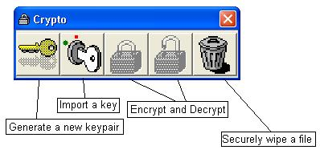



## Crypto 1\.0 Secure Encryption with code no EXE

### Description

Cypto 1.0 is a secure encryption program that uses public/private keys and includes a secure file wiper.
 
### More Info
 

             |
---                |---
**Submitted On**   |2002-07-08 09:41:16
**By**             |[Matthew Li \(mazzanet\)](https://github.com/Planet-Source-Code/PSCIndex/blob/master/ByAuthor/matthew-li-mazzanet.md)
**Level**          |Intermediate
**User Rating**    |4.8 (19 globes from 4 users)
**Compatibility**  |VB 5\.0, VB 6\.0
**Category**       |[Encryption](https://github.com/Planet-Source-Code/PSCIndex/blob/master/ByCategory/encryption__1-48.md)
**World**          |[Visual Basic](https://github.com/Planet-Source-Code/PSCIndex/blob/master/ByWorld/visual-basic.md)
**Archive File**   |[Crypto\_1\_0103772792002\.zip](https://github.com/Planet-Source-Code/matthew-li-mazzanet-crypto-1-0-secure-encryption-with-code-no-exe__1-36721/archive/master.zip)

